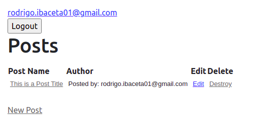

# Secret Club Posting Site

> This site is about posting anonymously, in a way that only logged in users can see the Author. Anonymous users can only see the post, but not the author.

Anonymous users can:
  - Click a post title to view it's body
  - Create an account

Logged in users can:
  - Create new Posts
  - See the author of other posts
  - Edit or Destroy their own posts

Logged in users cannot
  - Edit or Destroy other people's post

## Built With

- Ruby 3.0.0 
- Rails 6
- Devise
- HTML5
- Bootstrap (CDN)

## Getting Started

**This is an example of how you may give instructions on setting up your project locally.**
**Modify this file to match your project, remove sections that don't apply. For example: delete the testing section if the currect project doesn't require testing.**

To get a local copy up and running follow these simple example steps.

### Install
- Clone the [repo](https://github.com/RokoVarano/secret_club)
- In the terminal, cd 'secret_club'
- run 'bundle install'
- run 'rails db:migrate'

### Usage
- run 'rails s'
- In your browser, go to [localhost:3000](http://127.0.0.1:3000)
- To create a user, click in 'Login' button, and then click in 'Sign up'. Fill the Form
- To Log in, fill the Log in form with an existing email and password
- To create a Post, click on New Post
- In the main page, you can edit or delete your post.
- You can check any post (yours or otherwise) by clicking on the post title link.
- To verify that you cannot modify other people's post, create a new user. You will notice that you do not have the 'Edit' and 'Delete' links available on posts that are not from the current user.

## Authors

👤 **John hernandez**
- GitHub: [@johnhernandez-code](https://github.com/johnhernandez-code)
- Twitter: [@JohnHernCode](https://twitter.com/JohnHernCode)
- LinkedIn: [John Hernandez](https://www.linkedin.com/in/john-hernandez-56a7821b8/) (editado) 

👤 **Rodrigo Ibaceta**

- GitHub: [Rodrigo Ibateca](https://github.com/RokoVarano/)
- Twitter: [@Rodrigo](https://twitter.com/RodrigoIbacet11)
- LinkedIn: [LinkedIn](https://www.linkedin.com/in/rodrigo-ibaceta-a8657611a/)

## 🤝 Contributing

Contributions, issues, and feature requests are welcome!

Feel free to check the [issues page](issues/).

## Show your support

Give a ⭐️ if you like this project!

## Acknowledgments

- Hat tip to anyone whose code was used
- Inspiration
- etc

## 📝 License

This project is [MIT](lic.url) licensed.